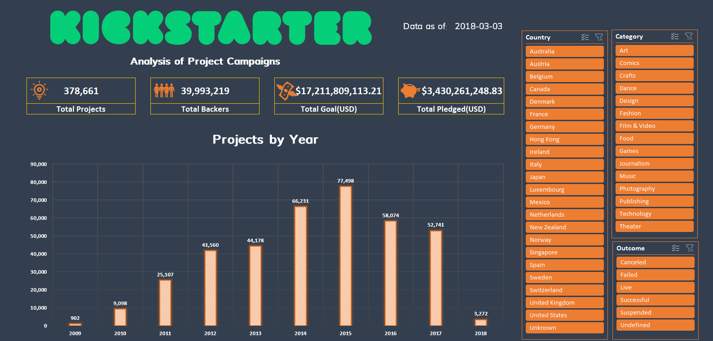

# Kickstarter Campaigns: Data analysis and Dashboard Creation with MS Excel

Data: [Kickstarter Campaigns Data](data/Data_Kickstarter_Projects.csv)

### Dashboard

## Objective

Create an interactive dashboard showcasing results of an analysis of Kickstarter Campaigns.

### Data Cleaning

Concepts: CLEAN, TRIM, PROPER, UPPER, Filter, Paste Special Values

1. Convert file format from CSV to XLSX to (1) preserve integrity of original data source and (2) ensure that all changes are saved.
2. Format for easier viewing (i.e. freezing header row, center-aligning, adjust column widths, etc.).
3. Delete unnecessary data columns and rename columns, as needed.
4. Format data types accordingly.
5. Clean and trim individual string data types (=CLEAN(TRIM(PROPER(A2))) or =CLEAN(TRIM(UPPER(E2))) ). Populate the rest of the rows using the fill handle.
6. Copy the cleaned values over to the appropriate columns (Ctrl+Shift+Down Arrow, Ctrl+C, Ctrl+Home, Click on appropriate column, Right click, "Paste Special", "Values").
7. Check for null values. Make judgment call, whether to keep or delete data with null values. If deleting, filter, select, delete sheet rows to avoid leaving blank rows in the worksheet.

### Data Transformation

Concepts: Lookup Functions (VLOOKUP, XLOOKUP), INDEX MATCH, Working with multiple excel files, mapping values, Pivot tables

1. Using any of the lookup functions or INDEX MATCH, match the country code to the spelt out country name from another excel file (["Country_Code.xlsx"](analysis/Country_Code.xlsx)).

- =VLOOKUP(E2,'[Country_Code.xlsx]Country Codes'!$A:$B,2,FALSE)
- =IFERROR(INDEX('[Country_Code.xlsx]Country Codes'!$B:$B,MATCH(E2,'[Country_Code.xlsx]Country Codes'!$A:$A,0)),"Unknown")
- =XLOOKUP(E2,'[Country_Code.xlsx]Country Codes'!$A:$A,'[Country_Code.xlsx]Country Codes'!$B:$B,"Unknown")

2. If you decided to keep the data with null values, there are two ways to deal with it:
   a) Update the country code file by adding a new entry, Column A = N,0", Column B = Unknown;
   b) Use IFERROR() formula. Tip: Nest the VLOOKUP function in the IFERROR function.

3. Rename column, copy and paste special values (to hardcode it and to stop it linking it to another file. This makes the file lighter and faster to work with.)

4. Create pivot tables and slicers, in accordance with how your dashboard is supposed to look like.

5. Build dashboard/summary report in a new worksheet.

## Contact

Email: [may.lacdao@gmail.com]

Linkedin: [Connect with me!](https://www.linkedin.com/in/maylacdao/)
